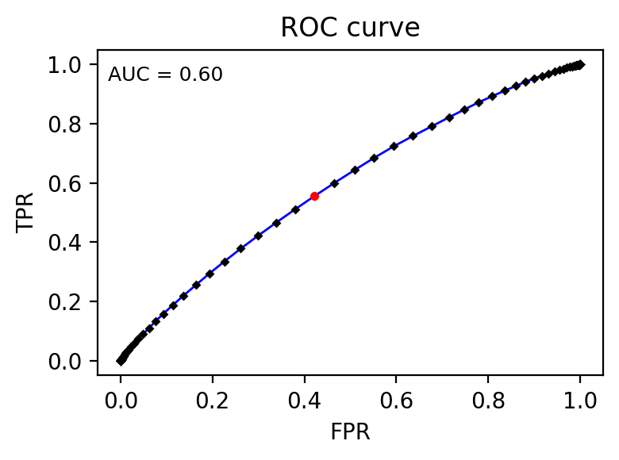
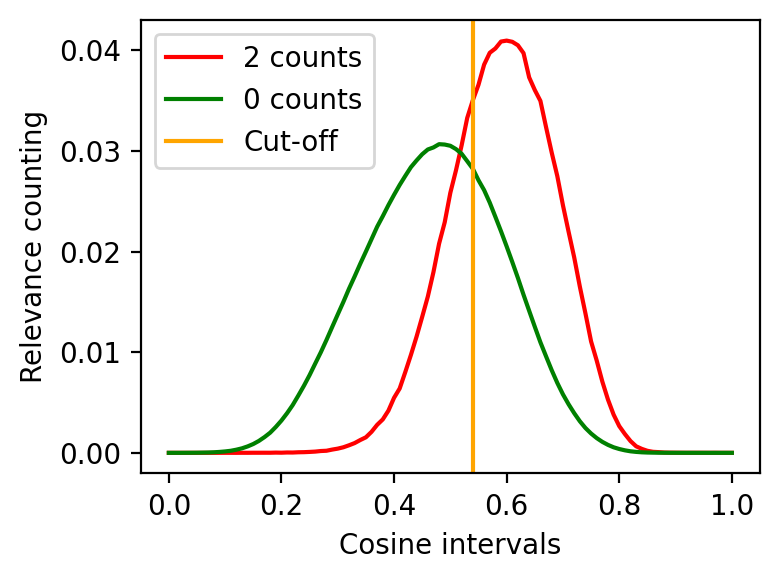

# Hyperparameter optimizacion - ROC One vs All approach

This notebook is not intended as a tutorial. This notebook was not properly tested and may not work as intended.

This file was **not used to execute the hyperparameter optimization**. It was used to study the results. The commands executed were:

```bash
nohup python3 code/Distribution_Analysis/hp_optimization.py --folder data/Distribution_Analysis/Hybrid_hp_RELISH --dataset RELISH --save_ROC 1 >> Hybrid_hp_RELISH.log 2>&1 &

nohup python3 code/Distribution_Analysis/hp_optimization.py --folder data/Distribution_Analysis/Hybrid_hp_TREC_simplified --dataset TREC --repurposed 1 --save_ROC 1 >> Hybrid_hp_TREC_simplified.log 2>&1 &

nohup python3 code/Distribution_Analysis/hp_optimization.py --folder data/Distribution_Analysis/Hybrid_hp_TREC_repurposed --dataset TREC --repurposed 1 --save_ROC 1 >> Hybrid_hp_TREC_repurposed.log 2>&1 &
```

# Execution

First, we need to import all the required functions.


```python
%load_ext autoreload
%autoreload 2

import os
import sys

repository_path = os.path.expanduser("~/hybrid-dictionary-ner-doc2vec-doc-relevance")
medline_preprocessing_repository_path = os.path.expanduser("~/medline-preprocessing")

sys.path.append(f"{repository_path}/code/embeddings/")
sys.path.append(f"{medline_preprocessing_repository_path}/code/Distribution_Analysis/")
os.chdir(repository_path)

import logging
import numpy as np

import create_model as cm
import fill_relevance_matrix as frm
import counting_table as ct
import ROC_curve as ROC
import hp_optimization as hp

logging.basicConfig(format='%(asctime)s %(message)s')
```

## RELISH
The following code blocks test for all combinations of hyperparameters for the RELISH dataset and shows the results and plots.


```python
# For RELISH
hp_df_path = "data/Hyperparameter_optimization/RELISH_hp_df.tsv"

params_d2v = {
    "dm": [0, 1],
    "vector_size": [256, 512], 
    "window": [5, 7, 9], 
    "min_count": [1, 3, 5], 
    "epochs": [15], 
    "workers": [16]}

hp_df = hp.generate_hyperparameters(params_d2v)
hp.save_file(hp_df, hp_df_path, overwrite=False)

hp.logger.setLevel("WARNING")
hp_df = hp.hyperparameter_optimization_pipeline(hp_df_path, verbose = 0, dataset = "RELISH", repurposed = False, folder_path = None, restore_search = 1, save_CT = False, save_ROC = False)
hp_df
```

    2022-09-11 12:21:16,890 There is already a file in this path. To replace the file, please use 'overwrite = True'.


<div>

<table border="1" class="dataframe">
  <thead>
    <tr style="text-align: right;">
      <th></th>
      <th>dm</th>
      <th>epochs</th>
      <th>min_count</th>
      <th>vector_size</th>
      <th>window</th>
      <th>workers</th>
      <th>AUC</th>
    </tr>
  </thead>
  <tbody>
    <tr>
      <th>0</th>
      <td>0</td>
      <td>15</td>
      <td>1</td>
      <td>256</td>
      <td>5</td>
      <td>8</td>
      <td>0.5820</td>
    </tr>
    <tr>
      <th>1</th>
      <td>0</td>
      <td>15</td>
      <td>1</td>
      <td>256</td>
      <td>7</td>
      <td>8</td>
      <td>0.5817</td>
    </tr>
    <tr>
      <th>2</th>
      <td>0</td>
      <td>15</td>
      <td>1</td>
      <td>256</td>
      <td>9</td>
      <td>8</td>
      <td>0.5822</td>
    </tr>
    <tr>
      <th>3</th>
      <td>0</td>
      <td>15</td>
      <td>1</td>
      <td>512</td>
      <td>5</td>
      <td>8</td>
      <td>0.5841</td>
    </tr>
    <tr>
      <th>4</th>
      <td>0</td>
      <td>15</td>
      <td>1</td>
      <td>512</td>
      <td>7</td>
      <td>8</td>
      <td>0.5841</td>
    </tr>
    <tr>
      <th>5</th>
      <td>0</td>
      <td>15</td>
      <td>1</td>
      <td>512</td>
      <td>9</td>
      <td>8</td>
      <td>0.5838</td>
    </tr>
    <tr>
      <th>6</th>
      <td>0</td>
      <td>15</td>
      <td>3</td>
      <td>256</td>
      <td>5</td>
      <td>8</td>
      <td>0.5808</td>
    </tr>
    <tr>
      <th>7</th>
      <td>0</td>
      <td>15</td>
      <td>3</td>
      <td>256</td>
      <td>7</td>
      <td>8</td>
      <td>0.5799</td>
    </tr>
    <tr>
      <th>8</th>
      <td>0</td>
      <td>15</td>
      <td>3</td>
      <td>256</td>
      <td>9</td>
      <td>8</td>
      <td>0.5806</td>
    </tr>
    <tr>
      <th>9</th>
      <td>0</td>
      <td>15</td>
      <td>3</td>
      <td>512</td>
      <td>5</td>
      <td>8</td>
      <td>0.5822</td>
    </tr>
    <tr>
      <th>10</th>
      <td>0</td>
      <td>15</td>
      <td>3</td>
      <td>512</td>
      <td>7</td>
      <td>8</td>
      <td>0.5822</td>
    </tr>
    <tr>
      <th>11</th>
      <td>0</td>
      <td>15</td>
      <td>3</td>
      <td>512</td>
      <td>9</td>
      <td>8</td>
      <td>0.5822</td>
    </tr>
    <tr>
      <th>12</th>
      <td>0</td>
      <td>15</td>
      <td>5</td>
      <td>256</td>
      <td>5</td>
      <td>8</td>
      <td>0.5792</td>
    </tr>
    <tr>
      <th>13</th>
      <td>0</td>
      <td>15</td>
      <td>5</td>
      <td>256</td>
      <td>7</td>
      <td>8</td>
      <td>0.5803</td>
    </tr>
    <tr>
      <th>14</th>
      <td>0</td>
      <td>15</td>
      <td>5</td>
      <td>256</td>
      <td>9</td>
      <td>8</td>
      <td>0.5790</td>
    </tr>
    <tr>
      <th>15</th>
      <td>0</td>
      <td>15</td>
      <td>5</td>
      <td>512</td>
      <td>5</td>
      <td>8</td>
      <td>0.5819</td>
    </tr>
    <tr>
      <th>16</th>
      <td>0</td>
      <td>15</td>
      <td>5</td>
      <td>512</td>
      <td>7</td>
      <td>8</td>
      <td>0.5813</td>
    </tr>
    <tr>
      <th>17</th>
      <td>0</td>
      <td>15</td>
      <td>5</td>
      <td>512</td>
      <td>9</td>
      <td>8</td>
      <td>0.5810</td>
    </tr>
    <tr>
      <th>18</th>
      <td>1</td>
      <td>15</td>
      <td>1</td>
      <td>256</td>
      <td>5</td>
      <td>8</td>
      <td>0.5886</td>
    </tr>
    <tr>
      <th>19</th>
      <td>1</td>
      <td>15</td>
      <td>1</td>
      <td>256</td>
      <td>7</td>
      <td>8</td>
      <td>0.5888</td>
    </tr>
    <tr>
      <th>20</th>
      <td>1</td>
      <td>15</td>
      <td>1</td>
      <td>256</td>
      <td>9</td>
      <td>8</td>
      <td>0.5848</td>
    </tr>
    <tr>
      <th>21</th>
      <td>1</td>
      <td>15</td>
      <td>1</td>
      <td>512</td>
      <td>5</td>
      <td>8</td>
      <td>0.5872</td>
    </tr>
    <tr>
      <th>22</th>
      <td>1</td>
      <td>15</td>
      <td>1</td>
      <td>512</td>
      <td>7</td>
      <td>8</td>
      <td>0.5861</td>
    </tr>
    <tr>
      <th>23</th>
      <td>1</td>
      <td>15</td>
      <td>1</td>
      <td>512</td>
      <td>9</td>
      <td>8</td>
      <td>0.5831</td>
    </tr>
    <tr>
      <th>24</th>
      <td>1</td>
      <td>15</td>
      <td>3</td>
      <td>256</td>
      <td>5</td>
      <td>8</td>
      <td>0.5946</td>
    </tr>
    <tr>
      <th>25</th>
      <td>1</td>
      <td>15</td>
      <td>3</td>
      <td>256</td>
      <td>7</td>
      <td>8</td>
      <td>0.5918</td>
    </tr>
    <tr>
      <th>26</th>
      <td>1</td>
      <td>15</td>
      <td>3</td>
      <td>256</td>
      <td>9</td>
      <td>8</td>
      <td>0.5910</td>
    </tr>
    <tr>
      <th>27</th>
      <td>1</td>
      <td>15</td>
      <td>3</td>
      <td>512</td>
      <td>5</td>
      <td>8</td>
      <td>0.5923</td>
    </tr>
    <tr>
      <th>28</th>
      <td>1</td>
      <td>15</td>
      <td>3</td>
      <td>512</td>
      <td>7</td>
      <td>8</td>
      <td>0.5903</td>
    </tr>
    <tr>
      <th>29</th>
      <td>1</td>
      <td>15</td>
      <td>3</td>
      <td>512</td>
      <td>9</td>
      <td>8</td>
      <td>0.5875</td>
    </tr>
    <tr>
      <th>30</th>
      <td>1</td>
      <td>15</td>
      <td>5</td>
      <td>256</td>
      <td>5</td>
      <td>8</td>
      <td>0.5969</td>
    </tr>
    <tr>
      <th>31</th>
      <td>1</td>
      <td>15</td>
      <td>5</td>
      <td>256</td>
      <td>7</td>
      <td>8</td>
      <td>0.5952</td>
    </tr>
    <tr>
      <th>32</th>
      <td>1</td>
      <td>15</td>
      <td>5</td>
      <td>256</td>
      <td>9</td>
      <td>8</td>
      <td>0.5917</td>
    </tr>
    <tr>
      <th>33</th>
      <td>1</td>
      <td>15</td>
      <td>5</td>
      <td>512</td>
      <td>5</td>
      <td>8</td>
      <td>0.5942</td>
    </tr>
    <tr>
      <th>34</th>
      <td>1</td>
      <td>15</td>
      <td>5</td>
      <td>512</td>
      <td>7</td>
      <td>8</td>
      <td>0.5925</td>
    </tr>
    <tr>
      <th>35</th>
      <td>1</td>
      <td>15</td>
      <td>5</td>
      <td>512</td>
      <td>9</td>
      <td>8</td>
      <td>0.5889</td>
    </tr>
  </tbody>
</table>
</div>


```python
RELISH_best_hp = hp_df.iloc[hp_df['AUC'].idxmax()].apply(int).to_dict()
RELISH_best_hp["AUC"] = hp_df.iloc[hp_df['AUC'].idxmax()]["AUC"]
RELISH_best_hp
```


    {'dm': 1,
     'epochs': 15,
     'min_count': 5,
     'vector_size': 256,
     'window': 5,
     'workers': 8,
     'AUC': 0.5969}


```python
input_tokens = "../data_full/RELISH/RELISH_tokens.tsv"
input_frm = "../data_full/RELISH/RELISH_relevance_matrix.tsv"

hp.logger.setLevel("INFO")
del RELISH_best_hp["AUC"]
filled_relevance_matrix = hp.hybrid_model_pipeline(RELISH_best_hp, input_tokens, input_frm, dataset = "RELISH", repurposed = False, verbose = 1)
counting_table = ct.hp_create_counting_table(filled_relevance_matrix, dataset = "RELISH", repurposed=False)
ROC.generate_roc_values(counting_table, dataset = "RELISH", repurposed = False)

ct.plot_graph(counting_table, dataset = "RELISH", normalize = True, best_cosine = ROC.calculate_best_cosine_interval(counting_table), output_path="data/Hyperparameter_optimization/RELISH_distribution.png")
ROC.draw_roc_curve(counting_table, draw_auc = True, output_path="data/Hyperparameter_optimization/RELISH_ROC.png")

```

    2022-09-11 12:21:17,385 	Previously generated model not found.
    2022-09-11 12:21:29,391 	Generating model.
    2022-09-11 12:21:41,157 	Training model.
    2022-09-11 12:31:34,332 --- Time to train: 593.17 seconds
    2022-09-11 12:31:34,335 	Previously generated filled relevance matrix not found.
    2022-09-11 12:31:34,393 	Filling relevance matrix.
    2022-09-11 12:32:04,525 --- Time to fill: 30.12 seconds


    

    


    

    


## TREC_simplified
The following code blocks test for all combinations of hyperparameters for the TREC simplified dataset and shows the results and plots.


```python
# For TREC simplified
hp_df_path = "data/Hyperparameter_optimization/TREC_simplified_hp_df.tsv"

params_d2v = {
    "dm": [0, 1],
    "vector_size": [256, 512], 
    "window": [5, 7, 9], 
    "min_count": [1, 3, 5], 
    "epochs": [15], 
    "workers": [16]}

# NOTE: Not all combinations in file are shown here. I decidd to manually add
# some extra combinations to the hp_df.tsv file
hp_df = hp.generate_hyperparameters(params_d2v)
hp.save_file(hp_df, hp_df_path, overwrite=False)

hp.logger.setLevel("WARNING")
hp_df = hp.hyperparameter_optimization_pipeline(hp_df_path, verbose = 0, dataset = "TREC", repurposed = False, restore_search = 1, save_CT = False, save_ROC = False)
hp_df
```

    2022-09-11 12:32:06,743 There is already a file in this path. To replace the file, please use 'overwrite = True'.


<div>

<table border="1" class="dataframe">
  <thead>
    <tr style="text-align: right;">
      <th></th>
      <th>dm</th>
      <th>epochs</th>
      <th>min_count</th>
      <th>vector_size</th>
      <th>window</th>
      <th>workers</th>
      <th>AUC</th>
    </tr>
  </thead>
  <tbody>
    <tr>
      <th>0</th>
      <td>0</td>
      <td>15</td>
      <td>1</td>
      <td>256</td>
      <td>5</td>
      <td>16</td>
      <td>0.6615</td>
    </tr>
    <tr>
      <th>1</th>
      <td>0</td>
      <td>15</td>
      <td>1</td>
      <td>256</td>
      <td>7</td>
      <td>16</td>
      <td>0.6613</td>
    </tr>
    <tr>
      <th>2</th>
      <td>0</td>
      <td>15</td>
      <td>1</td>
      <td>256</td>
      <td>9</td>
      <td>16</td>
      <td>0.6615</td>
    </tr>
    <tr>
      <th>3</th>
      <td>0</td>
      <td>15</td>
      <td>1</td>
      <td>512</td>
      <td>5</td>
      <td>16</td>
      <td>0.6607</td>
    </tr>
    <tr>
      <th>4</th>
      <td>0</td>
      <td>15</td>
      <td>1</td>
      <td>512</td>
      <td>7</td>
      <td>16</td>
      <td>0.6609</td>
    </tr>
    <tr>
      <th>5</th>
      <td>0</td>
      <td>15</td>
      <td>1</td>
      <td>512</td>
      <td>9</td>
      <td>16</td>
      <td>0.6610</td>
    </tr>
    <tr>
      <th>6</th>
      <td>0</td>
      <td>15</td>
      <td>3</td>
      <td>256</td>
      <td>5</td>
      <td>16</td>
      <td>0.6556</td>
    </tr>
    <tr>
      <th>7</th>
      <td>0</td>
      <td>15</td>
      <td>3</td>
      <td>256</td>
      <td>7</td>
      <td>16</td>
      <td>0.6560</td>
    </tr>
    <tr>
      <th>8</th>
      <td>0</td>
      <td>15</td>
      <td>3</td>
      <td>256</td>
      <td>9</td>
      <td>16</td>
      <td>0.6559</td>
    </tr>
    <tr>
      <th>9</th>
      <td>0</td>
      <td>15</td>
      <td>3</td>
      <td>512</td>
      <td>5</td>
      <td>16</td>
      <td>0.6559</td>
    </tr>
    <tr>
      <th>10</th>
      <td>0</td>
      <td>15</td>
      <td>3</td>
      <td>512</td>
      <td>7</td>
      <td>16</td>
      <td>0.6558</td>
    </tr>
    <tr>
      <th>11</th>
      <td>0</td>
      <td>15</td>
      <td>3</td>
      <td>512</td>
      <td>9</td>
      <td>16</td>
      <td>0.6558</td>
    </tr>
    <tr>
      <th>12</th>
      <td>0</td>
      <td>15</td>
      <td>5</td>
      <td>256</td>
      <td>5</td>
      <td>16</td>
      <td>0.6527</td>
    </tr>
    <tr>
      <th>13</th>
      <td>0</td>
      <td>15</td>
      <td>5</td>
      <td>256</td>
      <td>7</td>
      <td>16</td>
      <td>0.6533</td>
    </tr>
    <tr>
      <th>14</th>
      <td>0</td>
      <td>15</td>
      <td>5</td>
      <td>256</td>
      <td>9</td>
      <td>16</td>
      <td>0.6527</td>
    </tr>
    <tr>
      <th>15</th>
      <td>0</td>
      <td>15</td>
      <td>5</td>
      <td>512</td>
      <td>5</td>
      <td>16</td>
      <td>0.6528</td>
    </tr>
    <tr>
      <th>16</th>
      <td>0</td>
      <td>15</td>
      <td>5</td>
      <td>512</td>
      <td>7</td>
      <td>16</td>
      <td>0.6525</td>
    </tr>
    <tr>
      <th>17</th>
      <td>0</td>
      <td>15</td>
      <td>5</td>
      <td>512</td>
      <td>9</td>
      <td>16</td>
      <td>0.6528</td>
    </tr>
    <tr>
      <th>18</th>
      <td>1</td>
      <td>15</td>
      <td>1</td>
      <td>256</td>
      <td>5</td>
      <td>16</td>
      <td>0.6305</td>
    </tr>
    <tr>
      <th>19</th>
      <td>1</td>
      <td>15</td>
      <td>1</td>
      <td>256</td>
      <td>7</td>
      <td>16</td>
      <td>0.6265</td>
    </tr>
    <tr>
      <th>20</th>
      <td>1</td>
      <td>15</td>
      <td>1</td>
      <td>256</td>
      <td>9</td>
      <td>16</td>
      <td>0.6226</td>
    </tr>
    <tr>
      <th>21</th>
      <td>1</td>
      <td>15</td>
      <td>1</td>
      <td>512</td>
      <td>5</td>
      <td>16</td>
      <td>0.6306</td>
    </tr>
    <tr>
      <th>22</th>
      <td>1</td>
      <td>15</td>
      <td>1</td>
      <td>512</td>
      <td>7</td>
      <td>16</td>
      <td>0.6264</td>
    </tr>
    <tr>
      <th>23</th>
      <td>1</td>
      <td>15</td>
      <td>1</td>
      <td>512</td>
      <td>9</td>
      <td>16</td>
      <td>0.6212</td>
    </tr>
    <tr>
      <th>24</th>
      <td>1</td>
      <td>15</td>
      <td>3</td>
      <td>256</td>
      <td>5</td>
      <td>16</td>
      <td>0.6374</td>
    </tr>
    <tr>
      <th>25</th>
      <td>1</td>
      <td>15</td>
      <td>3</td>
      <td>256</td>
      <td>7</td>
      <td>16</td>
      <td>0.6343</td>
    </tr>
    <tr>
      <th>26</th>
      <td>1</td>
      <td>15</td>
      <td>3</td>
      <td>256</td>
      <td>9</td>
      <td>16</td>
      <td>0.6298</td>
    </tr>
    <tr>
      <th>27</th>
      <td>1</td>
      <td>15</td>
      <td>3</td>
      <td>512</td>
      <td>5</td>
      <td>16</td>
      <td>0.6377</td>
    </tr>
    <tr>
      <th>28</th>
      <td>1</td>
      <td>15</td>
      <td>3</td>
      <td>512</td>
      <td>7</td>
      <td>16</td>
      <td>0.6349</td>
    </tr>
    <tr>
      <th>29</th>
      <td>1</td>
      <td>15</td>
      <td>3</td>
      <td>512</td>
      <td>9</td>
      <td>16</td>
      <td>0.6303</td>
    </tr>
    <tr>
      <th>30</th>
      <td>1</td>
      <td>15</td>
      <td>5</td>
      <td>256</td>
      <td>5</td>
      <td>16</td>
      <td>0.6400</td>
    </tr>
    <tr>
      <th>31</th>
      <td>1</td>
      <td>15</td>
      <td>5</td>
      <td>256</td>
      <td>7</td>
      <td>16</td>
      <td>0.6376</td>
    </tr>
    <tr>
      <th>32</th>
      <td>1</td>
      <td>15</td>
      <td>5</td>
      <td>256</td>
      <td>9</td>
      <td>16</td>
      <td>0.6335</td>
    </tr>
    <tr>
      <th>33</th>
      <td>1</td>
      <td>15</td>
      <td>5</td>
      <td>512</td>
      <td>5</td>
      <td>16</td>
      <td>0.6393</td>
    </tr>
    <tr>
      <th>34</th>
      <td>1</td>
      <td>15</td>
      <td>5</td>
      <td>512</td>
      <td>7</td>
      <td>16</td>
      <td>0.6371</td>
    </tr>
    <tr>
      <th>35</th>
      <td>1</td>
      <td>15</td>
      <td>5</td>
      <td>512</td>
      <td>9</td>
      <td>16</td>
      <td>0.6332</td>
    </tr>
    <tr>
      <th>36</th>
      <td>0</td>
      <td>15</td>
      <td>0</td>
      <td>256</td>
      <td>5</td>
      <td>16</td>
      <td>0.6616</td>
    </tr>
    <tr>
      <th>37</th>
      <td>0</td>
      <td>15</td>
      <td>0</td>
      <td>256</td>
      <td>7</td>
      <td>16</td>
      <td>0.6614</td>
    </tr>
    <tr>
      <th>38</th>
      <td>0</td>
      <td>15</td>
      <td>0</td>
      <td>256</td>
      <td>9</td>
      <td>16</td>
      <td>0.6613</td>
    </tr>
    <tr>
      <th>39</th>
      <td>0</td>
      <td>15</td>
      <td>0</td>
      <td>512</td>
      <td>5</td>
      <td>16</td>
      <td>0.6613</td>
    </tr>
    <tr>
      <th>40</th>
      <td>0</td>
      <td>15</td>
      <td>0</td>
      <td>512</td>
      <td>7</td>
      <td>16</td>
      <td>0.6613</td>
    </tr>
    <tr>
      <th>41</th>
      <td>0</td>
      <td>15</td>
      <td>0</td>
      <td>512</td>
      <td>9</td>
      <td>16</td>
      <td>0.6612</td>
    </tr>
  </tbody>
</table>
</div>


```python
TREC_best_hp = hp_df.iloc[hp_df['AUC'].idxmax()].apply(int).to_dict()
TREC_best_hp["AUC"] = hp_df.iloc[hp_df['AUC'].idxmax()]["AUC"]
TREC_best_hp
```


    {'dm': 0,
     'epochs': 15,
     'min_count': 0,
     'vector_size': 256,
     'window': 5,
     'workers': 16,
     'AUC': 0.6616}


```python
input_tokens = "../data_full/TREC/TREC_tokens.tsv"
input_frm = "../data_full/TREC/TREC_simplified_relevance_matrix.tsv"

hp.logger.setLevel("INFO")
del TREC_best_hp["AUC"]
filled_relevance_matrix = hp.hybrid_model_pipeline(TREC_best_hp, input_tokens, input_frm, dataset = "TREC", repurposed = False, verbose = 1)
counting_table = ct.hp_create_counting_table(filled_relevance_matrix, dataset = "TREC", repurposed=False)
ROC.generate_roc_values(counting_table, dataset = "TREC", repurposed = False)

ct.plot_graph(counting_table, dataset = "TREC", normalize = True, best_cosine = ROC.calculate_best_cosine_interval(counting_table), output_path="data/Hyperparameter_optimization/TREC_simplified_distribution.png")
ROC.draw_roc_curve(counting_table, draw_auc = True, output_path="data/Hyperparameter_optimization/TREC_simplified_ROC.png")
```

    2022-09-11 12:32:07,243 	Previously generated model not found.
    2022-09-11 12:32:08,980 	Generating model.
    2022-09-11 12:32:12,548 	Training model.
    2022-09-11 12:33:37,590 --- Time to train: 85.04 seconds
    2022-09-11 12:33:37,591 	Previously generated filled relevance matrix not found.
    2022-09-11 12:33:43,082 	Filling relevance matrix.
    2022-09-11 12:36:17,527 --- Time to fill: 152.58 seconds


    

    


    

    


## TREC_repurposed
The following code blocks test for all combinations of hyperparameters for the TREC repurposed dataset and shows the results and plots.


```python
# For TREC
hp_df_path = "data/Hyperparameter_optimization/TREC_repurposed_hp_df.tsv"

params_d2v = {
    "dm": [0, 1],
    "vector_size": [256, 512], 
    "window": [5, 7, 9], 
    "min_count": [1, 3, 5], 
    "epochs": [15], 
    "workers": [16]}

# NOTE: Not all combinations in file are shown here. I decidd to manually add
# some extra combinations to the hp_df.tsv file
hp_df = hp.generate_hyperparameters(params_d2v)
hp.save_file(hp_df, hp_df_path, overwrite=False)

hp.logger.setLevel("WARNING")
hp_df = hp.hyperparameter_optimization_pipeline(hp_df_path, verbose = 0, dataset = "TREC", repurposed = True, restore_search = 1, save_CT = False, save_ROC = False)
hp_df
```

    2022-09-11 12:36:29,711 There is already a file in this path. To replace the file, please use 'overwrite = True'.


<div>

<table border="1" class="dataframe">
  <thead>
    <tr style="text-align: right;">
      <th></th>
      <th>dm</th>
      <th>epochs</th>
      <th>min_count</th>
      <th>vector_size</th>
      <th>window</th>
      <th>workers</th>
      <th>AUC</th>
    </tr>
  </thead>
  <tbody>
    <tr>
      <th>0</th>
      <td>0</td>
      <td>15</td>
      <td>1</td>
      <td>256</td>
      <td>5</td>
      <td>16</td>
      <td>0.7823</td>
    </tr>
    <tr>
      <th>1</th>
      <td>0</td>
      <td>15</td>
      <td>1</td>
      <td>256</td>
      <td>7</td>
      <td>16</td>
      <td>0.7825</td>
    </tr>
    <tr>
      <th>2</th>
      <td>0</td>
      <td>15</td>
      <td>1</td>
      <td>256</td>
      <td>9</td>
      <td>16</td>
      <td>0.7828</td>
    </tr>
    <tr>
      <th>3</th>
      <td>0</td>
      <td>15</td>
      <td>1</td>
      <td>512</td>
      <td>5</td>
      <td>16</td>
      <td>0.7823</td>
    </tr>
    <tr>
      <th>4</th>
      <td>0</td>
      <td>15</td>
      <td>1</td>
      <td>512</td>
      <td>7</td>
      <td>16</td>
      <td>0.7819</td>
    </tr>
    <tr>
      <th>5</th>
      <td>0</td>
      <td>15</td>
      <td>1</td>
      <td>512</td>
      <td>9</td>
      <td>16</td>
      <td>0.7816</td>
    </tr>
    <tr>
      <th>6</th>
      <td>0</td>
      <td>15</td>
      <td>3</td>
      <td>256</td>
      <td>5</td>
      <td>16</td>
      <td>0.7750</td>
    </tr>
    <tr>
      <th>7</th>
      <td>0</td>
      <td>15</td>
      <td>3</td>
      <td>256</td>
      <td>7</td>
      <td>16</td>
      <td>0.7754</td>
    </tr>
    <tr>
      <th>8</th>
      <td>0</td>
      <td>15</td>
      <td>3</td>
      <td>256</td>
      <td>9</td>
      <td>16</td>
      <td>0.7747</td>
    </tr>
    <tr>
      <th>9</th>
      <td>0</td>
      <td>15</td>
      <td>3</td>
      <td>512</td>
      <td>5</td>
      <td>16</td>
      <td>0.7748</td>
    </tr>
    <tr>
      <th>10</th>
      <td>0</td>
      <td>15</td>
      <td>3</td>
      <td>512</td>
      <td>7</td>
      <td>16</td>
      <td>0.7751</td>
    </tr>
    <tr>
      <th>11</th>
      <td>0</td>
      <td>15</td>
      <td>3</td>
      <td>512</td>
      <td>9</td>
      <td>16</td>
      <td>0.7753</td>
    </tr>
    <tr>
      <th>12</th>
      <td>0</td>
      <td>15</td>
      <td>5</td>
      <td>256</td>
      <td>5</td>
      <td>16</td>
      <td>0.7719</td>
    </tr>
    <tr>
      <th>13</th>
      <td>0</td>
      <td>15</td>
      <td>5</td>
      <td>256</td>
      <td>7</td>
      <td>16</td>
      <td>0.7718</td>
    </tr>
    <tr>
      <th>14</th>
      <td>0</td>
      <td>15</td>
      <td>5</td>
      <td>256</td>
      <td>9</td>
      <td>16</td>
      <td>0.7713</td>
    </tr>
    <tr>
      <th>15</th>
      <td>0</td>
      <td>15</td>
      <td>5</td>
      <td>512</td>
      <td>5</td>
      <td>16</td>
      <td>0.7706</td>
    </tr>
    <tr>
      <th>16</th>
      <td>0</td>
      <td>15</td>
      <td>5</td>
      <td>512</td>
      <td>7</td>
      <td>16</td>
      <td>0.7716</td>
    </tr>
    <tr>
      <th>17</th>
      <td>0</td>
      <td>15</td>
      <td>5</td>
      <td>512</td>
      <td>9</td>
      <td>16</td>
      <td>0.7709</td>
    </tr>
    <tr>
      <th>18</th>
      <td>1</td>
      <td>15</td>
      <td>1</td>
      <td>256</td>
      <td>5</td>
      <td>16</td>
      <td>0.7309</td>
    </tr>
    <tr>
      <th>19</th>
      <td>1</td>
      <td>15</td>
      <td>1</td>
      <td>256</td>
      <td>7</td>
      <td>16</td>
      <td>0.7233</td>
    </tr>
    <tr>
      <th>20</th>
      <td>1</td>
      <td>15</td>
      <td>1</td>
      <td>256</td>
      <td>9</td>
      <td>16</td>
      <td>0.7138</td>
    </tr>
    <tr>
      <th>21</th>
      <td>1</td>
      <td>15</td>
      <td>1</td>
      <td>512</td>
      <td>5</td>
      <td>16</td>
      <td>0.7295</td>
    </tr>
    <tr>
      <th>22</th>
      <td>1</td>
      <td>15</td>
      <td>1</td>
      <td>512</td>
      <td>7</td>
      <td>16</td>
      <td>0.7229</td>
    </tr>
    <tr>
      <th>23</th>
      <td>1</td>
      <td>15</td>
      <td>1</td>
      <td>512</td>
      <td>9</td>
      <td>16</td>
      <td>0.7138</td>
    </tr>
    <tr>
      <th>24</th>
      <td>1</td>
      <td>15</td>
      <td>3</td>
      <td>256</td>
      <td>5</td>
      <td>16</td>
      <td>0.7402</td>
    </tr>
    <tr>
      <th>25</th>
      <td>1</td>
      <td>15</td>
      <td>3</td>
      <td>256</td>
      <td>7</td>
      <td>16</td>
      <td>0.7347</td>
    </tr>
    <tr>
      <th>26</th>
      <td>1</td>
      <td>15</td>
      <td>3</td>
      <td>256</td>
      <td>9</td>
      <td>16</td>
      <td>0.7271</td>
    </tr>
    <tr>
      <th>27</th>
      <td>1</td>
      <td>15</td>
      <td>3</td>
      <td>512</td>
      <td>5</td>
      <td>16</td>
      <td>0.7420</td>
    </tr>
    <tr>
      <th>28</th>
      <td>1</td>
      <td>15</td>
      <td>3</td>
      <td>512</td>
      <td>7</td>
      <td>16</td>
      <td>0.7333</td>
    </tr>
    <tr>
      <th>29</th>
      <td>1</td>
      <td>15</td>
      <td>3</td>
      <td>512</td>
      <td>9</td>
      <td>16</td>
      <td>0.7265</td>
    </tr>
    <tr>
      <th>30</th>
      <td>1</td>
      <td>15</td>
      <td>5</td>
      <td>256</td>
      <td>5</td>
      <td>16</td>
      <td>0.7449</td>
    </tr>
    <tr>
      <th>31</th>
      <td>1</td>
      <td>15</td>
      <td>5</td>
      <td>256</td>
      <td>7</td>
      <td>16</td>
      <td>0.7380</td>
    </tr>
    <tr>
      <th>32</th>
      <td>1</td>
      <td>15</td>
      <td>5</td>
      <td>256</td>
      <td>9</td>
      <td>16</td>
      <td>0.7289</td>
    </tr>
    <tr>
      <th>33</th>
      <td>1</td>
      <td>15</td>
      <td>5</td>
      <td>512</td>
      <td>5</td>
      <td>16</td>
      <td>0.7431</td>
    </tr>
    <tr>
      <th>34</th>
      <td>1</td>
      <td>15</td>
      <td>5</td>
      <td>512</td>
      <td>7</td>
      <td>16</td>
      <td>0.7371</td>
    </tr>
    <tr>
      <th>35</th>
      <td>1</td>
      <td>15</td>
      <td>5</td>
      <td>512</td>
      <td>9</td>
      <td>16</td>
      <td>0.7282</td>
    </tr>
    <tr>
      <th>36</th>
      <td>0</td>
      <td>15</td>
      <td>0</td>
      <td>256</td>
      <td>5</td>
      <td>16</td>
      <td>0.7828</td>
    </tr>
    <tr>
      <th>37</th>
      <td>0</td>
      <td>15</td>
      <td>0</td>
      <td>256</td>
      <td>7</td>
      <td>16</td>
      <td>0.7823</td>
    </tr>
    <tr>
      <th>38</th>
      <td>0</td>
      <td>15</td>
      <td>0</td>
      <td>256</td>
      <td>9</td>
      <td>16</td>
      <td>0.7817</td>
    </tr>
    <tr>
      <th>39</th>
      <td>0</td>
      <td>15</td>
      <td>0</td>
      <td>512</td>
      <td>5</td>
      <td>16</td>
      <td>0.7812</td>
    </tr>
    <tr>
      <th>40</th>
      <td>0</td>
      <td>15</td>
      <td>0</td>
      <td>512</td>
      <td>7</td>
      <td>16</td>
      <td>0.7822</td>
    </tr>
    <tr>
      <th>41</th>
      <td>0</td>
      <td>15</td>
      <td>0</td>
      <td>512</td>
      <td>9</td>
      <td>16</td>
      <td>0.7818</td>
    </tr>
  </tbody>
</table>
</div>


```python
TREC_best_hp = hp_df.iloc[hp_df['AUC'].idxmax()].apply(int).to_dict()
TREC_best_hp["AUC"] = hp_df.iloc[hp_df['AUC'].idxmax()]["AUC"]
TREC_best_hp
```


    {'dm': 0,
     'epochs': 15,
     'min_count': 1,
     'vector_size': 256,
     'window': 9,
     'workers': 16,
     'AUC': 0.7828}


```python
input_tokens = "../data_full/TREC/TREC_tokens.tsv"
input_frm = "../data_full/TREC/TREC_repurposed_matrix.tsv"

hp.logger.setLevel("INFO")
del TREC_best_hp["AUC"]
filled_relevance_matrix = hp.hybrid_model_pipeline(TREC_best_hp, input_tokens, input_frm, dataset = "TREC", repurposed = True, verbose = 1)
counting_table = ct.hp_create_counting_table(filled_relevance_matrix, dataset = "TREC", repurposed=True)
ROC.generate_roc_values(counting_table, dataset = "TREC", repurposed = True)

ct.plot_graph(counting_table, dataset = "TREC", repurposed=True, normalize = True, best_cosine = ROC.calculate_best_cosine_interval(counting_table), output_path="data/Hyperparameter_optimization/TREC_repurposed_distribution.png")
ROC.draw_roc_curve(counting_table, draw_auc = True, output_path="data/Hyperparameter_optimization/TREC_repurposed_ROC.png")
```

    2022-09-11 12:36:29,986 	Previously generated model not found.
    2022-09-11 12:36:31,630 	Generating model.
    2022-09-11 12:36:35,254 	Training model.
    2022-09-11 12:38:03,295 --- Time to train: 88.04 seconds
    2022-09-11 12:38:03,297 	Previously generated filled relevance matrix not found.
    2022-09-11 12:38:06,343 	Filling relevance matrix.
    2022-09-11 12:40:32,036 --- Time to fill: 145.04 seconds


    

    


    

    


# Final results:

<div>
<table border="1" class="dataframe">
  <thead>
    <tr style="text-align: right;">
      <th>Dataset</th>
      <th>dm</th>
      <th>epochs</th>
      <th>min_count</th>
      <th>vector_size</th>
      <th>window</th>
      <th>workers</th>
      <th>AUC</th>
    </tr>
  </thead>
  <tbody>
    <tr>
      <th>RELISH</th>
      <td>1</td>
      <td>15</td>
      <td>5</td>
      <td>256</td>
      <td>5</td>
      <td>8</td>
      <th>0.5969</th>
    </tr>
    <tr>
      <th>TREC simplified</th>
      <td>0</td>
      <td>15</td>
      <td>0</td>
      <td>256</td>
      <td>5</td>
      <td>16</td>
      <th>0.6616</th>
    </tr>
    <tr>
      <th>TREC repurposed</th>
      <td>0</td>
      <td>15</td>
      <td>1</td>
      <td>256</td>
      <td>9</td>
      <td>16</td>
      <th>0.7828</th>
    </tr>
  </tbody>
</table>
</div>